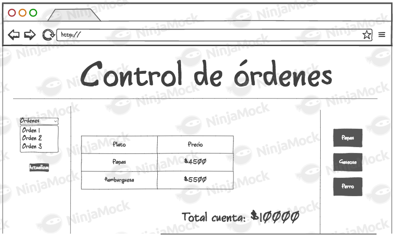
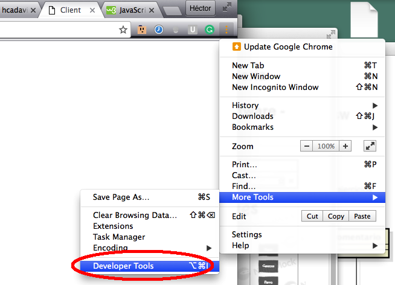

#### Escuela Colombiana de Ingeniería
#### Procesos de desarrollo de software - PDSW
#### Laboratorio - Construcción de cliente de API REST con HTML5, CSS3 y JavaScript. + JavaScript Promises.

El siguiente, es el 'mock' de la aplicación que se quiere desarrollar para manejar las órdenes de restaurante, cuyo API fue desarrollado en el ejercicio anterior:




La funcionalidad acordada es:

* Por ahora, no hay la opción de crear nuevas órdenes. Simplemente se pueden consultar y modificar las órdenes existentes.
* Cuando se abre la aplicación, automáticamente se cargan los platos que ofrece el restaurante (parte derecha de la interfaz).
* Para consultar las órdenes disponibles, se debe seleccionar la opción 'actualizar' (parte izquierda de la interfaz).
* Cuando se seleccione una orden en particular, la parte central de la interfaz será actualizada, mostrando una tabla con los platos que hacen parte de la misma, mostrando también el valor actual de la cuenta (la cual es calculada por el servidor, de acuerdo con la configuración que tenga actualmente el mismo).
* Una vez se tenga seleccionada una orden, se podrán 'arrastrar' los platos al área central de la pantalla. Cuando esto se haga, se debe modificar la orden actualmente abierta, agregando dicho plato, y recalculando el valor de la cuenta.


###Entorno de trabajo

1. Copie los [fuentes base](fuentes.zip) (index.html, model.js, controller.js, styles.css) en la ruta  src/main/resources/static dentro del proyecto.
2. En esta misma ruta, ejecute un servidor HTTP (esto es sólo para facilitar el desarrollo y depuración:

	```bash
	$ python -m SimpleHTTPServer
```
3. Abra el contenido en la ruta http://localhost:8000 en el navegador Chrome.
4. Active las herramientas de desarrollo de Chrome:

	


### Parte 1.

1. Teniendo en cuenta la estructura planteada en el Mock, y los elementos dispuestos en el DOM (identificados dentro de un '\<div>'), modifique la hoja de estilo 'styles.css' para que los mismos sigan una distribución acorde al mismo. Recomendación: use el selector basado en id.
2. Haga que, en cuanto se dibuje la vista, se agreguen todos los platos disponibles en la parte derecha de la interfaz (es decir, agregando tantos elementos \<li> al elemento \<ul> como platos haya disponibles (por ahora, solo use los datos de prueba). Tenga en cuenta, a dichos elementos (\<li>), asociarles el estilo ".draggable", y asociarles como identificador el mismo nombre del plato respectivo:

	```html
	<li id='papas' class='draggable'>papas</li>
	```
	
3. Haga que, en cuanto se oprima el botón de 'actualizar', el elemento \<select> de la parte izquierda de la vista se llene con tantas opciones como Ordenes haya disponibles (por ahora usar datos estáticos). En este caso es necesario que los elementos \<option> generados incluyan como propuedad 'value' el número de la orden. Por ejemplo: \<option value='1'>1\</option>.
4. Haga que, una vez se tenga cargado el listado de Ordenes, al seleccionar una de éstas, se actualice el contenido central de la vista, mostrando:
	* Una tabla con los platos incluídos en la orden.
	* El valor total del pedido (esto ya está parcialmente hecho en el controlador).

5. Haga que los elementos del listado de platos sean 'draggables', haciendo que, al momento de ser creados, se les dé dicha propiedad:

	```javascript
 $("li").draggable({
        helper: 'clone'
    });	
	```
	
	Y haciendo que todo el contenido central sea 'droppable', y que cuando éste reciba un elemento 'draggable' (el nombre de un plato), lo agregue a la orden abierta actualmente:
   

	```javascript
	 $("#contenido").droppable({
                drop: function (event, ui) { 
	             		var idElementoSoltado=ui.draggable.attr("id");
                    agregarPlatoOrdenActual(idElementoSoltado);
                }
            });
	```

### Parte 2.

1. Modifique la función agregarPlatoOrdenActual para que funcione con el API del servidor. Para esto, haga que al agregarse un plato a una orden dicha orden sea actualizada en el servidor, y una vez hecho esto, consulte (en el API) y muestre el nuevo precio de la misma. Como jQuery no tiene funciones para peticiones PUT o DELETE, es necesario 'configurarlas' manualmente a través de su API para AJAX. Por ejemplo, para hacer una peticion PUT al recurso /platos:

	```javascript
    return $.ajax({
        url: "/platos",
        type: 'PUT',
        data: '{"precio":1000,"nombre":"papas"}',
        contentType: "application/json"
    });
    
	```

	Por otro lado, tenga en cuenta cómo usar las promesas de JavaScript [mediante alguno de los ejemplos disponibles](http://codepen.io/hcadavid/pen/jrwdgK).

2. Modifique la función actualizarOrdenesDisponibles para que consulte las órdenes del API, en lugar de mostrar los datos de prueba.
3. En su API de SpringBoot, agregue el recurso '/platos' (use un conjunto estático de platos).
3. Modifique la función actualizarPlatosDisponibles para que se al momento de usarse utilice los datos del API en lugar de los datos de prueba.


### Criterios de evaluación

1. El cliente Web consulta correctamente del API las ordenes y los platos disponibles.
2. Al arrastrar el plato a la orden, ésta es actualiza en el servidor, y el valor es actualizado (consultándolo al servidor).
